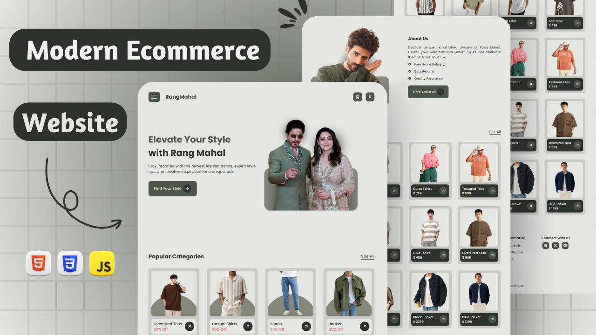

<div align="center">
  


[](https://twitter.com/intent/follow?screen_name=withaarzoo)
[](https://youtu.be/KXymZtuRRyk)

  <br />
  <br />

  <h2 align="center">Multipage Ecommerce Website – RangMahal</h2>

Welcome to the RangMahal project! This repository contains the source code for building a beautiful, SEO-optimized multi-page ecommerce website using HTML, CSS, and JavaScript. The website includes a homepage (index.html), About Us page, Products page, and a Contact Us page, all designed to offer a seamless user experience for ecommerce stores.

  <div>
    <a href="https://youtu.be/DjJTXXKETiE?si=fMJJDU_vfIv0QwdL"><strong>➥ Watch Tutorial</strong></a>
    <br>
    <br>
    <a href="tel:+917586073575"><strong>➥ Download Full Source Code : +91 7586073575 ( WhatsApp )</strong></a>
  </div>

</div>

## Getting Started

To start using the RangMahal website, follow these simple steps:

1. Clone the repository to your local machine:

```bash
git clone https://github.com/withaarzoo/Multi-Page-Ecommerce-Website---RangMahal.git
```

2. Open the project in your favorite code editor.

3. Customize the pages (index, about, products, and contact) to align with your brand and products.

## Project Structure

This multi-page ecommerce website includes the following key pages:

- Homepage (index.html): Features the main sections of the website and highlights products and offers.
- About Us (about.html): Tells the story of your brand, values, and team.
- Products (products.html): Displays the range of products available, each with images, descriptions, and prices.
- Contact Us (contact.html): Contains a form for visitors to get in touch with your business, along with contact details.

## Essential Links

- Remix Icon : [visit site](https://ionic.io/ionicons)
- Google Fonts : [visit site](https://www.emailjs.com/)
- Email JS : [visit site](https://www.emailjs.com/)

## Source Code

For the full source code, you can connect via WhatsApp:

- +917586073575 ( WhatsApp )

## Video Tutorial

Need some extra guidance? Watch our video tutorial on setting up and customizing your website:

- [SEO Optimized Multipage E-Commerce Website Tutorial](https://youtu.be/DjJTXXKETiE?si=fMJJDU_vfIv0QwdL)

## Connect with Me

If you want to contact me you can reach me at [Bento](https://bento.me/withaarzoo).

## Thumbnail



---

**Happy Coding!** 🚀
